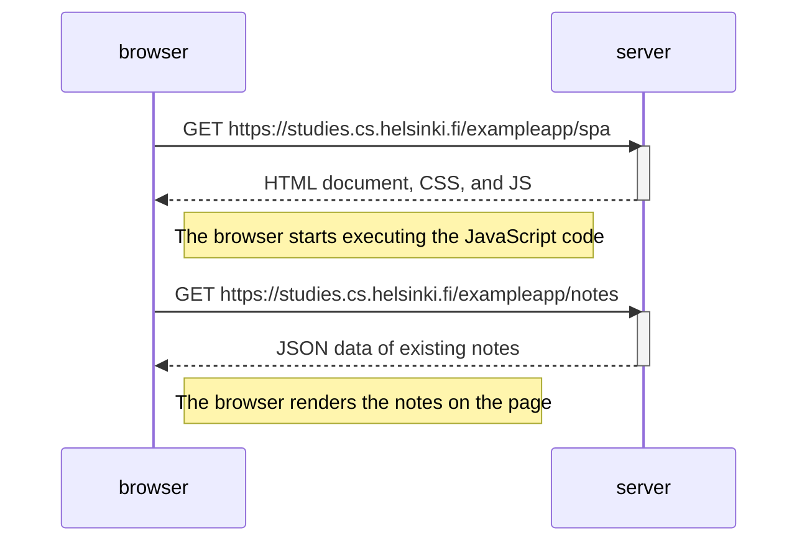

```mermaid
sequenceDiagram
    participant browser
    participant server

    browser->>server: GET https://studies.cs.helsinki.fi/exampleapp/spa
    activate server
    server-->>browser: HTML document, CSS, and JS
    deactivate server

    Note right of browser: The browser starts executing the JavaScript code

    browser->>server: GET https://studies.cs.helsinki.fi/exampleapp/notes
    activate server
    server-->>browser: JSON data of existing notes
    deactivate server

    Note right of browser: The browser renders the notes on the page
```