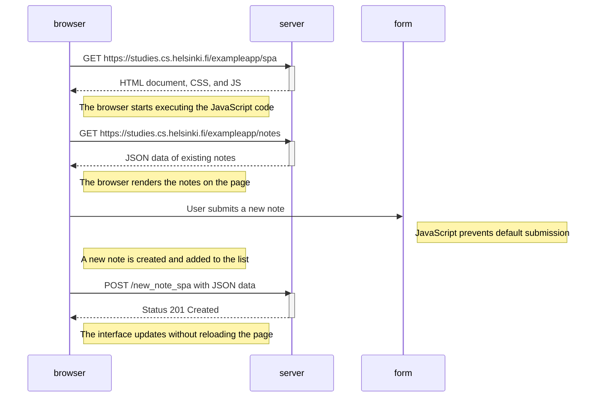

```mermaid
sequenceDiagram
    participant browser
    participant server

    browser->>server: GET https://studies.cs.helsinki.fi/exampleapp/spa
    activate server
    server-->>browser: HTML document, CSS, and JS
    deactivate server

    Note right of browser: The browser starts executing the JavaScript code

    browser->>server: GET https://studies.cs.helsinki.fi/exampleapp/notes
    activate server
    server-->>browser: JSON data of existing notes
    deactivate server

    Note right of browser: The browser renders the notes on the page

    browser->>form: User submits a new note
    Note right of form: JavaScript prevents default submission

    Note right of browser: A new note is created and added to the list
    browser->>server: POST /new_note_spa with JSON data
    activate server
    server-->>browser: Status 201 Created
    deactivate server

    Note right of browser: The interface updates without reloading the page
```