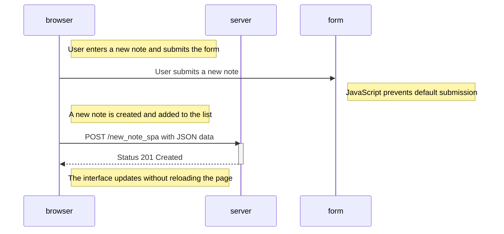

```mermaid
sequenceDiagram
    participant browser
    participant server

    Note right of browser: User enters a new note and submits the form
    browser->>form: User submits a new note
    Note right of form: JavaScript prevents default submission

    Note right of browser: A new note is created and added to the list
    browser->>server: POST /new_note_spa with JSON data
    activate server
    server-->>browser: Status 201 Created
    deactivate server

    Note right of browser: The interface updates without reloading the page
```